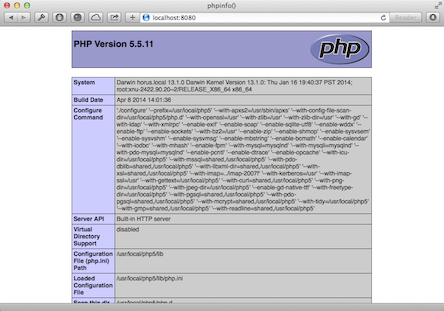
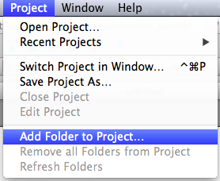
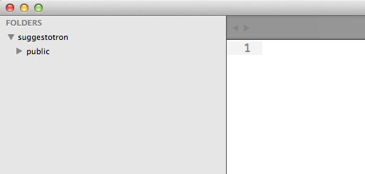

# Getting Started

* Create Your New Application

  Let's get started! By the end of this step, we'll have a brand-new (empty) web app.



## Steps

1. cd stands for change directory.

    Type this in the terminal:

    ```bash
    cd /var/www
    ```

    cd /var/www changes to the default web directory.

1. Type this in the terminal:

    ```bash
    mkdir suggestotron
    ```

    This command creates a new directory for us to store our project in.

1. Type this in the terminal:

    ```bash
    console "cd suggestotron"
    ```

1. Type this in the terminal:

    ```bash
    console "mkdir public"
    ```

    This creates a directory to hold everything that will be publicly accessible

1. Open the `suggestotron` directory as a project in your text editor.

    In **Sublime Text**, you can use the `Project > Add Folder to Project...` menu option:

    

    Select your `suggestotron` directory from the file picker that opens. If everything works out Sublime should look something like this:

    

1. Next, create a new file called `index.php` in the `public` directory, and type the following:

    ```php
    <?php
    phpinfo();
    ```

1. Now, start the PHP web server

    ```bash
    php -S 0.0.0.0:8080 -t ./public/
    ```

1. Point your web browser to <http://localhost:8080>

    See your "web app" actually running!

## Explanation

We now have a running PHP server, showing the configuration of our PHP installation.

Any changes you make from now on will be immediately visible simply by refreshing your browser.

next_step "creating a database"
