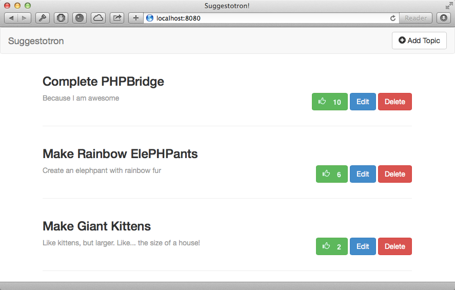

# Completing Suggestotron

* Add voting to Suggestotron

## Complete Suggestotron

Suggestrotron is not really complete unless we can rank suggestions by popular vote.

We're going to use all of the new skills we've learned, to build out this new feature.

## Steps

1. Just like with our topics, we will start out by defining our database table, `votes`:

    |  votes   |
    | -------- |
    | id       |
    | title_id |
    | count    |

    To get started, we run the `mysql` command in the terminal:

    ```bash
    mysql -u root -p
    ```

    When prompted, enter the password: `root`.

1. We then run our SQL code:

    ```sql
    USE suggestotron;

    CREATE TABLE votes (
        id INT unsigned NOT NULL AUTO_INCREMENT,
        topic_id INT unsigned NOT NULL,
        count INT NOT NULL DEFAULT 0,
        PRIMARY KEY(id)
    );
    ```

1. Create empty vote records for each of your existing topics:

    ```sql
    INSERT INTO votes (
        topic_id,
        count
    ) SELECT id, 0 FROM topics;
    ```

    Verify our data:

    ```sql
    SELECT * FROM votes;
    ```

    Approximate expected result:

    ```sql
    SELECT * FROM votes;
    +----+----------+-------+
    | id | topic_id | count |
    +----+----------+-------+
    |  1 |        1 |     0 |
    |  2 |        2 |     0 |
    |  3 |        3 |     0 |
    +----+----------+-------+
    3 rows in set (0.00 sec)
    ```

1. Update our Topics model class, to insert an empty row when creating new topics automatically:

    ```php
    public function add($data)
    {
        $query = \\Suggestotron\\Db::getInstance()->prepare(
            "INSERT INTO topics (
                    title,
                    description
            ) VALUES (
                    :title,
                    :description
            )"
        );

        $data = [
            ':title' => $data['title'],
            ':description' => $data['description']
        ];

        $query->execute($data);

        // Grab the newly created topic ID
        $id = \\Suggestotron\\Db::getInstance()->lastInsertId();

        // Add empty vote row
        $sql = "INSERT INTO votes (
                    topic_id,
                    count
                ) VALUES (
                    :id,
                    0
                )";

        $data = [
            ':id' => $id
        ];

        $query = \\Suggestotron\\Db::getInstance()->prepare($sql);
        $query->execute($data);
    }
    ```

1. We must also remove this data, when deleting the topic:

    ```php
    public function delete($id) {
        $query = \Suggestotron\Db::getInstance()->prepare(
            "DELETE FROM topics
                WHERE
                    id = :id"
        );

        $data = [
            ':id' => $id,
        ];

        $result = $query->execute($data);

        if (!$result) {
            return false;
        }

        $sql = "DELETE FROM votes WHERE topic_id = :id";
        $query = \\Suggestotron\\Db::getInstance()->prepare($sql);

        return $query->execute($data);
    }
    ```

1. We now need a model class to manage our votes, `\\Suggestotron\\Model\\Votes`:

    ```php
    <?php
    namespace Suggestotron\\Model;

    class Votes {
        public function addVote($topic_id)
        {
            $sql = "UPDATE votes
                    SET
                        count = count + 1
                    WHERE
                        topic_id = :id";

            $query = \\Suggestotron\\Db::getInstance()->prepare($sql);

            $data = [
                ':id' => $topic_id,
            ];

            return $query->execute($data);
        }
    }
    ```

1. Next up, we create our controller, `\\Suggestotron\\Controller\\Votes`, with an `add` action.

    ```php
    <?php
    namespace Suggestotron\\Controller;

    class Votes extends \\Suggestotron\\Controller {
        public function addAction($options) {
            if (!isset($options['id']) || empty($options['id'])) {
                echo "No topic id specified!";
                exit;
            }

            $votes = new \\Suggestotron\\Model\\Votes();
            $votes->addVote($options['id']);

            header("Location: /");
        }
    }
    ```

1. To access our new controller, we should add a route to `config/routes.php`:

    ```php
    '/vote(/:action(/:id))' => [
            'controller' => '\\Suggestotron\\Controller\\Votes',
    ],
    ```

    This route should be placed **above** the generic `/:controller(/:action)` route which will otherwise catch the request.

1. To allow our users to actually vote, we'll add a button to our topic list view, `index/list.phtml`, before our `Edit` and `Delete` buttons:

    ```html
    <a href="/vote/add/<?=$topic['id']; ?>" class="btn btn-success">
        <span class="glyphicon glyphicon-thumbs-up">
            <strong><?=(isset($topic['count'])) ? $topic['count'] : 0;?></strong>
        </span>
    </a>
    ```

1. Finally, we need to update our `\\Suggestotron\\Model\\Topics` model, to both retrieve the votes for each topic, and sort by the number of votes:

    ```php
    public function getAllTopics()
    {
        $sql = "SELECT
                    topics.*,
                    votes.count
                FROM topics INNER JOIN votes ON (
                    votes.topic_id = topics.id
                )
                ORDER BY votes.count DESC, topics.title ASC";

        $query = \\Suggestotron\\Db::getInstance()->prepare($sql);
        $query->execute();
        return $query;
    }
    ```

## Explanation

Guess what?  _**You\'re done!!!**_ Congratulations, you just "finished" your first web app!

(They're never _really_ ever finished... have fun tweaking it!)

Go take a look at your masterpiece: <http://localhost:8080>

It should look something like this:



next_step "credits_and_next_steps"