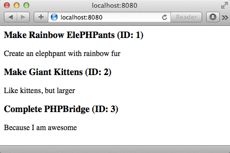

# Creating a Data Class

* Write a class to get our data

* Display the topics on a web page

  A class is a special piece of code for performing a given task

## Steps

1. Create a new file called `TopicData.php` in the `public` directory

    Type the following to create our empty class:

    ```php
    <?php
    class TopicData {
        // CLASS CONTENTS GO HERE
    }
    ```

1. Now create a connect function:

    ```php
    <?php
    class TopicData {
        protected $connection;

        public function connect()
        {
            $this->connection = new PDO("mysql:host=localhost;dbname=suggestotron", "root", "root");
        }
    }
    ```

1. Next lets make the class fetch all of our topics:

    ```php
    <?php
    class TopicData {

        protected $connection = null;

        public function connect()
        {
            $this->connection = new PDO("mysql:host=localhost;dbname=suggestotron", "root", null);
        }

        public function getAllTopics()
        {
            $query = $this->connection->prepare("SELECT * FROM topics");
            $query->execute();

            return $query;
        }
    }
    ```

    > Notice how we use the same `SELECT` as in the previous section

1. Now we can use the data class in `index.php`, to get our topics:

    ```php
    <?php
    require 'TopicData.php';

    $data = new TopicData();
    $data->connect();

    $topics = $data->getAllTopics();
    ```

    Now `$topics` is a database result object containing our topics.

1. Now we have our topics lets display them by using a `foreach` to iterate over them:

    ```php
    foreach ($topics as $topic) {
        echo "<h3>" .$topic['title']. " (ID: " .$topic['id']. ")</h3>";
        echo "<p>";
        echo nl2br($topic['description']);
        echo "</p>";
    }
    ```

1. To see what this looks like, refresh the application in your browser!

    

## Explanation

With just these few lines of code we are able to connect to our database, fetch our data, and dynamically create an HTML page. *How neat is that?*

next_step "adding_topics"
