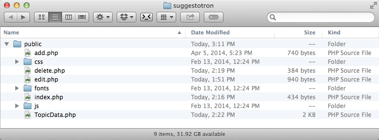
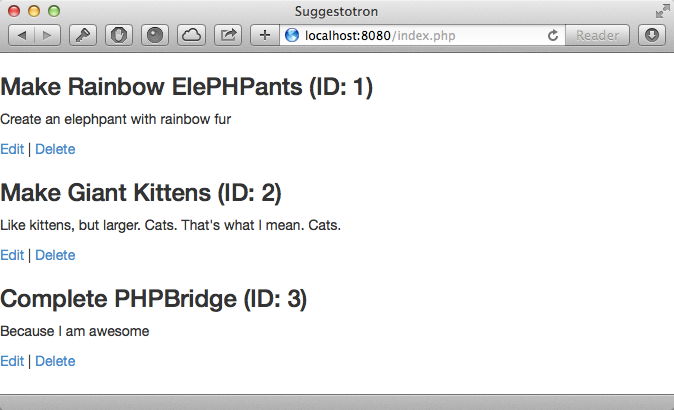

# Styling Suggestotron

* Make our application look visually appealing

## Steps

1. The first thing we need to do is to go back to our original pages (`index.php`, `add.php` and `edit.php`) and add more HTML to turn them into complete pages:

    Rather than using `echo` to output our HTML, we will instead put it *outside* our PHP, by using the closing and opening tags.

    For example, `index.php` now becomes:

    ```php
    <?php
    require 'TopicData.php';

    $data = new TopicData();
    $data->connect();

    $topics = $data->getAllTopics();
    ?>
    <!doctype html>
    <html>
        <head>
            <title>Suggestotron</title>
        </head>
        <body>
            <?php
            foreach ($topics as $topic) {
                echo "<h3>" .$topic['title']. " (ID: " .$topic['id']. ")</h3>";
                echo "<p>";
                echo nl2br($topic['description']);
                echo "</p>";
                echo "<p>";
                echo "<a href='/edit.php?id=" .$topic['id']. "'>Edit</a>";
                echo " | ";
                echo "<a href='/delete.php?id=" .$topic['id']. "'>Delete</a>";
                echo "</p>";
            }
            ?>
        </body>
    </html>
    ```

1. We're going to use the Bootstrap framework to quickly and easily make our application look great!

    You can download the framework from [getbootstrap.com](http://getbootstrap.com)

    After unzipping it, copy the `css`, `js` and `fonts` directories in to your `public` directory

    

1. Now we can start by adding it to our document. In the `<head>` of `index.php` add the link to the stylesheet:

    ```html
    <link rel="stylesheet" type="text/css" href="/css/bootstrap.min.css">
    ```

    Refresh your browser and you will now see something like this:

    

1. With the addition of Bootstrap, we can very quickly make our app look much more professional

    For example, by adding a simple class to our Edit and Delete links, we can make them look like buttons:

    ```php
    echo "<a href='/edit.php?id=" .$topic['id']. "' class='btn btn-primary'>Edit</a>";
    echo " ";
    echo "<a href='/delete.php?id=" .$topic['id']. "' class='btn btn-danger'>Delete</a>";
    ```

1. We can add a header bar:

    ```html
    <body>
        <nav class="navbar navbar-default" role="navigation">
            <div class="container-fluid">
                <div class="navbar-header">
                    <a class="navbar-brand" href="#">Suggestotron</a>
                </div>
            </div>
        </nav>
        ...
    ```

1. We can add other things to our header, such as an "Add Topic" button:

    ```html
    <form class="navbar-form navbar-right" role="search">
        <a href="/add.php" class="btn btn-default">
            <span class="glyphicon glyphicon-plus-sign"></span>
            Add Topic
        </a>
    </form>
    ```

    >There are many other Glyphicons, for example for Edit and Delete buttons, go ahead and play around with them!

1. Now we can make the rest of our page look nicer!

    Boottrap's grid system allows us to use rows and columns to layout our page

    We are going to change our `foreach` to format each topic into a `<section>` with rows and columns:

    ```php
    <div class="container">
        <?php
        foreach ($topics as $topic) {
            ?>
            <section>
                <div class="row">
                    <div class="col-xs-12">
                        <h3><?=$topic['title'];?></h3>
                    </div>
                </div>
                <div class="row">
                    <div class="col-xs-8">
                        <p class="text-muted">
                            <?=nl2br($topic['description']);?>
                        </p>
                    </div>
                    <div class="col-xs-4">
                        <p class="pull-right">
                            <a href="/edit.php?id=<?=$topic['id']; ?>" class="btn btn-primary">Edit</a>
                            <a href="/delete.php?id=<?=$topic['id']; ?>" class="btn btn-danger">Delete</a>
                        </p>
                    </div>
                </div>
            </section>
            <hr>
            <?php
        }
    ?>
    </div>
    ```

    Notice how we break out of the PHP tags for larger sections of HTML, and use short echo tags to display our data.

1. The last thing we're going to do, is to add a warning for when people go to delete topics

    To use the Bootstrap javascript, we need to also include jQuery, which you can get from [jquery.com](http://jquery.com).

    Place the jquery Javascript file in the `public/js` directory.

    We then include both Javascript files in our `<head>` section:

    ```html
    <script type="text/javascript" src="/js/jquery-2.1.0.min.js"></script>
    <script type="text/javascript" src="/js/bootstrap.min.js"></script>
    ```

1. Now add the popover attributes to our Delete button:

    ```php
    <a href="/delete.php?id=<?=$topic['id']; ?>" class="btn btn-danger" data-container="body" data-toggle="popover" data-trigger="hover" data-placement="top" data-title="Are you sure?" data-content=" This cannot be undone!">Delete</a>
    ```

1. Finally, initialize the popovers by adding this at the bottom of our file (right above the `</body>` tag):

    ```html
    <script type="text/javascript">
        $('[data-toggle="popover"]').popover();
    </script>
    ```

## Explanation

By using off-the-shelf frameworks, Bootstrap 3 and jquery, we are able to quickly add a professional user interface to our application, drastically improving our user experience.

next_step "introducing_templates"