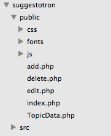
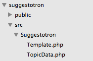

# Introducing Templates

* Add templates to easily style all of Suggestotron
* Learn about namespaces

  Templates allow us to re-use our work easily!

## Steps

1. We are going to create a new class for handling our templates.

    Now that we are adding more classes, let us create a directory especially for them:

    This directory should live in the root of our project, and is called `src`

    

    1. Our template class will live in the `src/Suggestotron/Template.php` file:

    ```php
    <?php
    namespace Suggestotron;

    class Template {
        protected $base_template;
        protected $page;

        public function __construct($base_template)
        {
            $this->base_template = $base_template;
        }

        public function render($page, $data = array())
        {
            foreach ($data as $key => $value) {
                $this->{$key} = $value;
            }

            $this->page = $page;
            require $this->base_template;
        }

        public function content()
        {
            require $this->page;
        }
    }
    ```

    > We are not the first people to create a `Template` class, to prevent it from conflicting with other peoples code, we use a namespace to make it unique. In this case, `Suggestotron`.

    To refer to our `Template` class, we should now use its full name `\\Suggestotron\\Template`

1. Now that we have a specific place for them to live, we should move our `TopicData` class to `src/Suggestotron/TopicData.php`, don't forget to add our namespace:

    ```php
    <?php
    namespace Suggestotron;

    class TopicData {
    ```

    Our `TopicData` class will now be `\\Suggestotron\\TopicData`

    

1. We can re-use a lot of our HTML on all our pages. Essentially, the only part unique to each page is the content inside the `container` div:

    ```html
    <div class="container">
        <!-- Specific Page Content Goes Here -->
    </div>
    ```

    We can split our HTML into re-usable templates, that will live in the `views` directory.

    This directory should live in the root of our project, just like `src`.

    We are going to create our template file, `views/base.phtml`, with the common HTML:

    > We use the `.phtml` extension to differentiate between regular PHP files, and templates files

    This includes our header, our container, and our footer

    ```html
    <!doctype html>
    <html>
        <head>
            <title>Suggestotron</title>
            <link rel="stylesheet" type="text/css" href="/css/bootstrap.min.css">
            <script type="text/javascript" src="/js/jquery-2.1.0.min.js"></script>
            <script type="text/javascript" src="/js/bootstrap.min.js"></script>
        </head>
        <body>
            <nav class="navbar navbar-default" role="navigation">
                <div class="container-fluid">
                    <div class="navbar-header">
                        <a class="navbar-brand" href="/">Suggestotron</a>
                    </div>
                    <form class="navbar-form navbar-right" role="search">
                        <a href="/add.php" class="btn btn-default">
                            <span class="glyphicon glyphicon-plus-sign"></span>
                            Add Topic
                        </a>
                    </form>
                </div>
            </nav>
            <div class="container">
                <!-- Specific Page Content Goes Here -->
                <?php $this->content(); ?>
            </div>
            <script type="text/javascript">
                $('[data-toggle="popover"]').popover();
            </script>
        </body>
    </html>
    ```

1. We then take our `index.php` specific HTML and create `views/index/index.phtml`.

    ```html
    <?php
    $topics = $this->topics;
    foreach ($topics as $topic) {
	?>
        <section>
            <div class="row">
                <div class="col-xs-12">
                    <h3><?=$topic['title'];?></h3>
                </div>
            </div>
            <div class="row">
                <div class="col-xs-8">
                    <p class="text-muted">
                        <?=nl2br($topic['description']);?>
                    </p>
                </div>
                <div class="col-xs-4">
                    <p class="pull-right">
                        <a href="/edit.php?id=<?=$topic['id']; ?>" class="btn btn-primary">Edit</a>
                        <a href="/delete.php?id=<?=$topic['id']; ?>" class="btn btn-danger" data-container="body" data-toggle="popover" data-trigger="hover" data-placement="top" data-title="Are you sure?" data-content=" This cannot be undone!">Delete</a>
                    </p>
                </div>
            </div>
        </section>
        <hr>
        <?php
    }
    ```

    Our topic data, previously assigned to `$topics` is now assigned to `$this->topics` by our template class. The first thing we do in our template file is re-assign it to `$topics` so we can use it easily inside our template.

1. Now we can update our `public/index.php` to use our template:

    ```php
    <?php
    require '../src/Suggestotron/TopicData.php';
    require '../src/Suggestotron/Template.php';

    $data = new \\Suggestotron\\TopicData();

    $topics = $data->getAllTopics();

    $template = new \\Suggestotron\\Template("../views/base.phtml");
    $template->render("../views/index/index.phtml", ['topics' => $topics]);
    ```

    > Notice how we pass the `$topics` variable into the `$template->render()` function. This allows our template to access the data we want it to. It will be accessible as `$this->topics` within the template.

1. If we check our site right now, you'll likely see that it's still broken!

    ```bash
    Fatal error: Class 'suggestotron\\PDO' not found in <path>/suggestotron/src/Suggestotron/TopicData.php on line 15
    ```

    This is because the `TopicData` class is now inside the `Suggestotron` namespace, where the `PDO` class does not live

    To fix this, we must fully-qualify the PDO class in `\\Suggestotron\\TopicData->connect()`, by prefixing it with a `\\`:

    ```php
    public function connect()
    {
        $this->connection = new \\PDO("mysql:host=192.168.1.10;dbname=suggestotron", "root", null);
    }
    ```

    Additionally, we need to prefix the `\\PDO::FETCH_ASSOC` constant passed to `$query->fetch()` in `\\Suggestotron\\TopicData->getTopic()`:

    ```php
    return $query->fetch(\\PDO::FETCH_ASSOC);
    ```

1. Now that our templates are working, lets add them to our other pages!

    For `add.php`, we will create a `views/index/add.phtml`:

    ```html
    <h2>New Topic</h2>
    <form action="add.php" method="POST">
        <label>
            Title: <input type="text" name="title">
        </label>
        <br>
        <label>
            Description:
            <br>
            <textarea name="description" cols="50" rows="20"></textarea>
        </label>
        <br>
        <input type="submit" class="btn btn-primary" value="Add Topic">
    </form>
    ```

    Then add the templates to `add.php`:

    ```php
    <?php
    require '../src/Suggestotron/TopicData.php';
    require '../src/Suggestotron/Template.php';

    if (isset($_POST) && sizeof($_POST) > 0) {
        $data = new \\Suggestotron\\TopicData();
        $data->add($_POST);
        header("Location: /");
        exit;
    }

    $template = new \\Suggestotron\\Template("../views/base.phtml");
    $template->render("../views/index/add.phtml");
    ```

1. Now, do the same for `edit.php`. For `edit.php`, we will create a `views/index/edit.phtml`:

    ```html
    <?php
    $topic = $this->topic;
    ?>
    <h2>Edit Topic</h2>
    <form action="edit.php" method="POST">
        <label>
            Title: <input type="text" name="title" value="<?=$topic['title'];?>">
        </label>
        <br>
        <label>
            Description:
            <br>
            <textarea name="description" cols="50" rows="20"><?=$topic['description'];?></textarea>
        </label>
        <br>
        <input type="hidden" name="id" value="<?=$topic['id'];?>">
        <input type="submit" class="btn btn-primary" value="Edit Topic">
    </form>
    ```

    Then `edit.php` needs to use the templates:

    ```php
    <?php
    require '../src/Suggestotron/TopicData.php';
    require '../src/Suggestotron/Template.php';

    if (isset($_POST['id']) && !empty($_POST['id'])) {
        $data = new \\Suggestotron\\TopicData();
        if ($data->update($_POST)) {
            header("Location: /index.php");
            exit;
        } else {
            echo "An error occurred";
        }
    }

    if (!isset($_GET['id']) || empty($_GET['id'])) {
        echo "You did not pass in an ID.";
        exit;
    }

    $data = new \\Suggestotron\\TopicData();
    $topic = $data->getTopic($_GET['id']);

    if ($topic === false) {
        echo "Topic not found!";
        exit;
    }

    $template = new \\Suggestotron\\Template("../views/base.phtml");
    $template->render("../views/index/edit.phtml", ['topic' => $topic]);
    ```

1. For `delete.php`, as we don't actually have any output, we just need to update the `TopicData` class

    ```php
    <?php
    require_once '../src/Suggestotron/TopicData.php';

    if (!isset($_GET['id']) || empty($_GET['id'])) {
        echo "You did not pass in an ID.";
        exit;
    }

    $data = new \\Suggestotron\\TopicData();
    $topic = $data->getTopic($_GET['id']);

    if ($topic === false) {
        echo "Topic not found!";
        exit;
    }

    if ($data->delete($_GET['id'])) {
        header("Location: /index.php");
        exit;
    } else {
        echo "An error occurred";
    }
    ```

## Explanation

By adding templates, we can easily make our sites styles consistent. Additionally, we stop ourselves from repeating the same HTML code everywhere, and can change it in one place and effect all of our pages at once!

next_step "autoloading"
